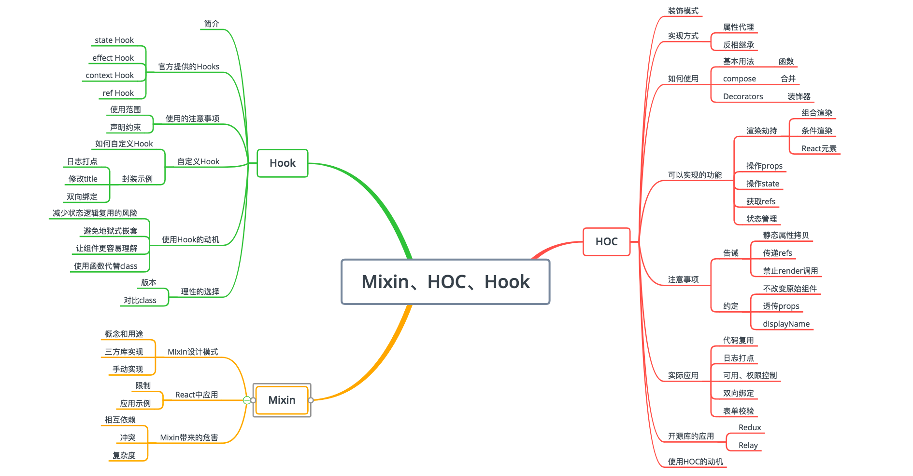

# 1. 从 Mixin 到 HOC 再到 Hook



## 1.1 Mixin 设计模式

- Mixin（混入）是一种通过扩展收集功能的方式，
- 它本质上是将一个对象的属性拷贝到另一个对象上面去，不过你可以拷贝任意多个对象的任意个方法到一个新对象上去，这是继承所不能实现的。
- 它的出现主要就是为了解决代码复用问题。
- 很多开源库提供了 Mixin 的实现，如 Underscore 的\_.extend 方法、JQuery 的 extend 方法。

手写一个简单的 Mixin 方法：

```js
// Mixin 手写实现

var LogMixin = {};
LogMixin.prototype = {
  actionLog: function () {
    console.log("action...");
  },
  requestLog: function () {
    console.log("request...");
  },
};
function User() {
  /*..*/
}
function Goods() {
  /*..*/
}
setMixin(User, LogMixin);
setMixin(Goods, LogMixin);
var user = new User();
var good = new Goods();
user.actionLog();
good.requestLog();

function setMixin(target, mixin) {
  if (!mixin) return;
  // 有第三个参数
  if (arguments[2]) {
    // 1. 遍历将第3个参数开始需要混入的属性赋值到target中
    for (let i = 2; i < arguments.length; i++) {
      target.prototype[arguments[i]] = mixin.prototype[arguments[i]];
    }
  } else {
    // 2. 遍历将mixin的原型对象中的属性添加到target对象的原型对象上
    for (let prop in mixin.prototype) {
      // mixin原型上的属性在target原型上找不到对应的属性
      if (!Object.hasOwnProperty(target.prototype, prop)) {
        target.prototype[prop] = mixin.prototype[prop];
      }
    }
  }
}
```

## 1.2 React 中应用 Mixin
